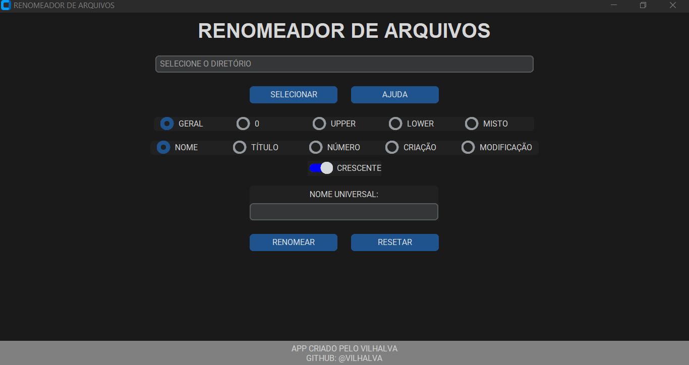
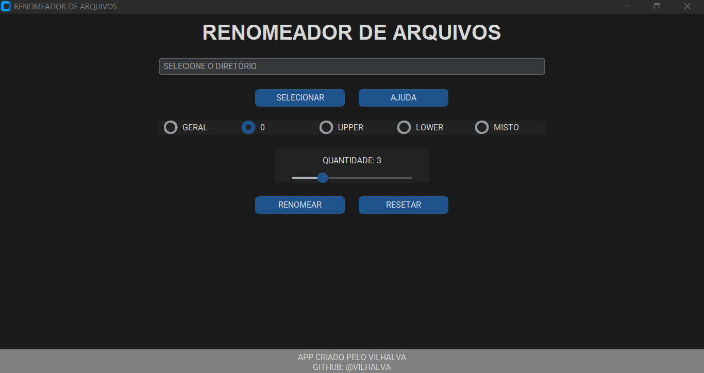
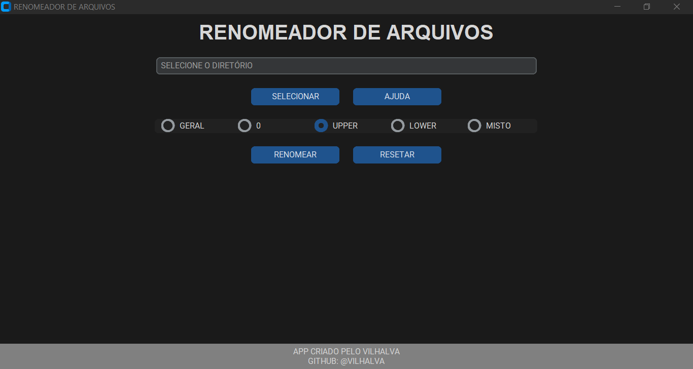

# RENOMEADOR DE ARQUIVOS
👨‍🏫RENOMEIE OS ARQUIVOS GLOBALMENTE.

 <br> 
 <br>
 <br>

## DESCRIÇÃO:
Este projeto é uma ferramenta gráfica avançada para renomeação em massa de arquivos, criada com `customtkinter`. Permite renomear arquivos de qualquer tipo em um diretório, de forma rápida, segura e personalizada.

Ideal para organizar grandes coleções de músicas, documentos, imagens e vídeos com rapidez e precisão.

## FUNCIONALIDADES:
* Diversos modos de renomeação, como numeração sequencial automática, conversão para maiúsculas, minúsculas ou capitalização mista, e padronização de números com zeros à esquerda.
* Definição de nome base personalizado para os arquivos.
* Vários critérios de ordenação antes da renomeação: por nome, título (metadado), número da faixa em MP3, data de criação ou modificação.
* Controle da ordem crescente ou decrescente via botão intuitivo.
* Ignora automaticamente arquivos ocultos e de sistema.
* Botão **RESETAR** para restaurar os nomes originais dos arquivos, garantindo segurança e reversibilidade no processo.

## RECURSOS:
### MODO DE RENOMEAÇÃO:
#### GERAL (NOME UNIVERSAL + NUMERAÇÃO SEQUENCIAL):
Renomeia todos os arquivos do diretório com um **nome universal opcional**, seguido de **numeração sequencial** ou **prefixo ajustado**, respeitando o critério de ordenação escolhido (NOME, CRIAÇÃO, MODIFICAÇÃO, etc.).

| NOME UNIVERSAL | ANTIGO NOME   | ARQUIVOS RENOMEADOS   | EXPLICAÇÃO                                               |
| -------------- | ------------- | ------------------------------ | ------------------------------------------------------------------ |
| *(vazio)*      | `Arquivo.ext` | `01.ext`, `02.ext`             | Apenas numeração sequencial, sem prefixo.                          |
| `05`           | `musica.ext`  | `05.ext`, `06.ext`, ...        | Começa do número `05`, sem separador ou nome.                      |
| `FAIXA`        | `Arquivo.ext` | `FAIXA 01.ext`, `FAIXA 02.ext` | Nome comum + numeração com zeros.                                  |
| `FAIXA 05`     | `song1.ext`   | `FAIXA 05.ext`, `FAIXA 06.ext` | Usa nome base com número inicial detectado. |
| - | `VALOR.ext` | `01-VALOR.ext`, `02-VALOR.ext` | Começa do `01`, usa hífen entre número e nome. |
| `05-` | `SONG.ext` | `05-SONG.ext`, `06-SONG.ext` | Começa do `05`, usa hífen entre número e nome. |
| ) | `VALOR.ext` | `01) VALOR.ext`, `02) VALOR.ext` | Começa do `01`, usa `)` com espaço. |
| `05)` | `SONG.ext` | `05) SONG.ext`, `06) SONG.ext` | Começa do `05`, usa `)` com espaço. |
| `_` | `VALOR.ext` | `01_VALOR.ext`, `02_VALOR.ext` | Usa underline `_` entre número e nome. |
| `05_` | `SONG.ext` | `05_SONG.ext`, `06_SONG.ext` | Usa underline `_` após número iniciado em `05`. |
| `$`  | `VALOR.ext` | `01 VALOR.ext`, `02 VALOR.ext` | Usa espaço entre número e nome. |
| `05$` | `SONG.ext` | `05 SONG.ext`, `06 SONG.ext` | Começa do `05`, separando com espaço ao invés de símbolo. |

#### MODO 0 – ADICIONA `ZEROS`:
* Adiciona zeros **automaticamente** em qualquer número detectado no **nome ou final do nome** dos arquivos, conforme a quantidade de dígitos escolhida no controle deslizante (padrão: **3 dígitos**).
* Apenas arquivos com **menos dígitos que o necessário** são alterados.
* Preserva nomes que **já possuem a quantidade correta de dígitos**.
* Detecta tanto números isolados (`"1.ext"`) quanto sufixos (`"Track 9"`), ou prefixos (`"07 Imagem.ext"`).
* Exemplo com **formatação para 3 dígitos**, conforme selecionado no controle deslizante:

| ANTIGO NOME     | NOVO NOME        |
| --------------- | ---------------- |
| `FAIXA 1.ext`   | `FAIXA 001.ext`  |
| `FAIXA 2.ext`   | `FAIXA 002.ext`  |
| `FAIXA 10.ext`  | `FAIXA 010.ext`  |
| `FAIXA 123.ext` | *(inalterado)*   |
| `7 Imagem.ext`  | `007 Imagem.ext` |
| `Video 45.ext`  | `Video 045.ext`  |
| `001.ext`       | *(inalterado)*   |
| `10.ext`        | `010.ext`        |

#### UPPER (NOMES EM `MAIÚSCULAS`):
Converte todos os nomes de arquivos para letras **maiúsculas**, mantendo espaços.

**Exemplo:**

```
meu documento.pdf → MEU DOCUMENTO.pdf
```

#### LOWER (NOMES EM `MINÚSCULAS`):
Converte todos os nomes de arquivos para letras **minúsculas**, mantendo espaços.

**Exemplo:**

```
Foto De Viagem.JPG → foto de viagem.JPG
```

#### MISTO (PRIMEIRAS LETRAS EM `MAIÚSCULAS`):
Converte apenas a **primeira letra de cada nome de arquivo** para maiúscula, mantendo o restante dos caracteres inalterado.

**Exemplo:**

```
FAIXA 01 → Faixa 01  
documento importante.txt → Documento importante.txt
```

### ORDEM DE RENOMEAÇÃO:
> Visível e aplicável apenas quando o `MODO` selecionado é `GERAL`.

#### NOME:
* **Ordenar por NOME:**
  - Ordena os arquivos em ordem alfabética pelo nome do arquivo (padrão simples).

#### TÍTULO:
* **Ordenar por TÍTULO:**
  - Ordena os arquivos com base no campo **Title** presente nas **metatags ID3** de arquivos `.ext`.
  - É útil quando os arquivos de áudio possuem títulos corretos definidos nas propriedades do arquivo.
  - A ordenação é feita em ordem alfabética dos títulos (ignorando maiúsculas/minúsculas).
  - Requer que os arquivos tenham metadados válidos; arquivos sem título serão considerados com valor vazio `("")` e geralmente colocados no final ou início da lista, dependendo da ordem selecionada (crescente ou decrescente).

#### NÚMERO:
* **Ordenar por NÚMERO:**
  - Ordena os arquivos com base no **número da faixa** obtido dos metadados, por exemplo, da tag `tracknumber` em arquivos `.ext`.
  - Para outros arquivos que não têm essa informação, usa uma ordenação alfabética simples.
  - Essa ordenação é útil para organizar faixas de música ou arquivos numerados conforme o número embutido nos metadados.

#### CRIAÇÃO:
* **Ordenar por DATA DE CRIAÇÃO:**
  - Ordena os arquivos pela data/hora em que foram criados no sistema de arquivos.

#### MODIFICAÇÃO:
* **Ordenar por Data de Modificação:**
  - Classifica os arquivos com base na **última data e hora em que foram alterados**.
  - Pode organizar do **mais antigo para o mais recente** ou vice-versa, dependendo da direção de ordenação escolhida (`CRESCENTE` ou `DESCRESCENTE`).

### BOTÃO CRESCENTE/DESCRESCENTE:
> Visível e aplicável apenas quando o `MODO` selecionado é `GERAL`.

Esse botão de **"CRESCENTE/DESCRESCENTE"** controla a ordem em que os arquivos são organizados antes de serem renomeados:

* **CRESCENTE** (ativado): ordena do menor para o maior — por exemplo, do nome "A" para "Z", do número 1 para 10, ou da data mais antiga para a mais recente.
* **DESCRESCENTE** (desativado): faz o contrário — do maior para o menor.

Essa ordem afeta todos os botões de ordenação: **NOME, TÍTULO, NÚMERO, CRIAÇÃO e MODIFICAÇÃO**.

### BOTÃO RESETAR:
O botão **RESETAR** permite **desfazer a última renomeação feita**, restaurando todos os arquivos aos seus **nomes originais anteriores**. Isso oferece uma camada extra de segurança ao processo, permitindo correções rápidas caso algo não saia como o esperado.

* **Como funciona?**
  - Ele só estará disponível **após uma renomeação** ser realizada.
  - Armazena um **backup temporário dos nomes antigos**, válido apenas até a próxima execução.
  - Ao clicar em **RESETAR**, os nomes dos arquivos são revertidos para o estado imediatamente anterior à última alteração.

* **Observações:**
  - Só reverte a **última operação** feita.
  - Se o app for fechado ou uma nova renomeação for realizada, a possibilidade de resetar será perdida.

## EXECUTANDO O PROJETO:
### 1. INSTALE AS DEPENDÊNCIAS:
Antes de iniciar o aplicativo, é necessário instalar as bibliotecas utilizadas no projeto. No terminal, execute:

```bash
pip install -r requirements.txt
```

> 💡 O arquivo `requirements.txt` está localizado dentro da pasta `./CODIGO`.

### 2. EXECUTE O APLICATIVO:
Navegue até o diretório `./CODIGO`, e execute o arquivo Python com o comando:
```bash
python CODIGO.py
```

### 3. USE O APLICATIVO:
Após abrir a janela chamada **"RENOMEADOR DE ARQUIVOS"**, siga os passos abaixo:

1. Clique em **"SELECIONAR"** para escolher a pasta onde estão os arquivos que deseja renomear.

2. No campo **"NOME UNIVERSAL"**, digite o nome base que será usado para renomear os arquivos (exemplo: `ARQUIVO`, `DOCUMENTO`, `MUSICA`, etc.).
   *Este campo é utilizado apenas no modo GERAL.*

3. Escolha um dos modos disponíveis:

   * `GERAL`: Renomeia todos os arquivos de um diretório usando um **nome base opcional** combinado com **numeração sequencial** ou **prefixo ajustado**, de acordo com o critério de ordenação escolhido (como nome, data de criação ou modificação). O usuário pode deixar o nome universal em branco para aplicar apenas a numeração (`01.ext`, `02.ext`), iniciar a contagem a partir de um número específico (`05.ext`), ou ainda incluir nomes personalizados com separadores como espaço, hífen, parêntese ou underline (ex: `FAIXA 01.ext`, `01-VALOR.ext`, `05) SONG.ext`). O sistema detecta e utiliza automaticamente o formato apropriado conforme o padrão fornecido.

      **Escolha a forma de ordenação dos arquivos antes da renomeação:**

        * `NOME`: Ordenação alfabética com base no nome atual do arquivo (renomeado manualmente).
        * `TÍTULO`: Ordenação com base no campo de **metadados "TÍTULO"** dos arquivos (comum em músicas `.ext`).
        * `NÚMERO`: Ordena pelos **números das faixas** extraídos dos metadados dos arquivos `.ext`.
        * `CRIAÇÃO`: Ordena pela **data de criação** dos arquivos.
        * `MODIFICAÇÃO`: Ordena pela **data da última modificação** dos arquivos.

      **Use o botão **CRESCENTE/DESCRESCENTE** para definir a direção da ordenação:**

        * Quando **ativado (CRESCENTE)**: ordena do menor para o maior (ex: `A → Z`, `1 → 10`, mais antigo → mais novo).
        * Quando **desativado (DESCRESCENTE)**: faz o contrário (ex: `Z → A`, `10 → 1`, mais novo → mais antigo).

   * `0`: Ajusta os números localizados no inicio ou no final do nome dos arquivos, **adicionando zeros** conforme a quantidade definida no **controle deslizante (slider de dígitos)**. O valor padrão é **3 dígitos**. Apenas arquivos com **menos dígitos do que o especificado** serão renomeados — os demais permanecem inalterados.

   * `UPPER`: Converte todos os nomes para letras **maiúsculas**.

   * `LOWER`: Converte todos os nomes para letras **minúsculas**.

   * `MISTO`: Deixa **apenas a primeira letra maiúscula** de cada nome, mantendo o restante dos caracteres inalterado.

5. Clique em **"RENOMEAR"** para iniciar o processo.

6. Após a renomeação, será exibida a mensagem de `Sucesso`.

7. (Opcional) Clique em **"RESETAR"** para desfazer a última renomeação e restaurar os nomes originais dos arquivos.

## SOBRE O EXECUTAVEL E O INSTALADOR:
### 1. EXECUTANDO O INSTALADOR:
  * O instalador está localizado no diretório `./APP` e está disponível apenas para sistemas **Windows x64**. Para realizar a instalação, basta **dar dois cliques no arquivo** e seguir as instruções exibidas na tela.

### 2. GERANDO O EXECUTAVEL:
> **IMPORTANTE:** Antes de criar o instalador, é necessário gerar o arquivo `RENOMEADOR DE ARQUIVOS.exe`. Para isso, siga os passos abaixo:

   **1. Instalação do PyInstaller:**
   * Certifique-se de ter o PyInstaller instalado. Se não tiver, instale usando o comando abaixo:
   ```bash
   pip install pyinstaller
   ```

   **2. Gerando o Executável:**
   * No diretório `./CODIGO`, utilize o comando abaixo para gerar o executável:

   ```bash
   pyinstaller EXECUTAVEL.spec
   ```

   * O executável `RENOMEADOR DE ARQUIVOS.exe` será criado na pasta `./CODIGO/dist`.
   * Após a geração, você pode excluir a pasta `./CODIGO/build`.

### 3. GERANDO O INSTALADOR:
#### PASSO 1: BAIXAR E INSTALAR O INNO SETUP:
1. **Download**: Baixe o Inno Setup do site oficial: [Inno Setup](http://www.jrsoftware.org/isdl.php).
2. **Instalação**: Siga o assistente de instalação para instalar o Inno Setup no seu sistema.

#### PASSO 2: CRIAR O INSTALADOR:
> **IMPORTANTE:** Antes de criar o novo instalador, certifique-se de excluir o arquivo `./APP/RENOMEADOR DE ARQUIVOS.exe`.

1. **Editar o arquivo do instalador:**
   * No diretório `./CODIGO`, abra o arquivo `INSTALADOR.iss` e atualize o seguinte trecho:

   * Localize a diretiva `#define Diretorio` e substitua pelo caminho correto do diretório do projeto. Exemplo:

     ```ini
     #define Diretorio "C:\Users\HP\Downloads\GITHUB\REPOSITORIO\02-PROJETOS PUBLICOS\02-APLICATIVOS\RENOMEADOR DE ARQUIVOS\CODIGO"
     ```

2. **Gerar o instalador no Inno Setup:**
   * Abra o arquivo `./CODIGO/INSTALADOR.iss` com o **Inno Setup**.
   * Clique em **"Compile"** para gerar o instalador.

3. **Limpar arquivos temporários:**
   * Após a criação do instalador, você pode excluir o executável temporário `./CODIGO/dist/RENOMEADOR DE ARQUIVOS.exe`.

4. **Instalando o Aplicativo:**
   * Se o `Aplicativo` não iniciar automaticamente a instalação, você pode executar manualmente o arquivo `./APP/RENOMEADOR DE ARQUIVOS.exe` clicando duas vezes sobre ele.
   * O assistente de instalação será iniciado e, por padrão, o aplicativo será instalado no seguinte caminho: `C:\Program Files\RENOMEADOR DE ARQUIVOS`.

## NÃO SABE?
- Entendemos que para manipular arquivos em muitas linguagens e tecnologias, é necessário possuir conhecimento nessas áreas. Para auxiliar nesse aprendizado, oferecemos cursos gratuitos e alguns subsídios:
* [CURSO DE PYTHON](https://github.com/VILHALVA/CURSO-DE-PYTHON)
* [CURSO DE CUSTOMTKINTER](https://github.com/VILHALVA/CURSO-DE-CUSTOMTKINTER)
* [CURSO DE AUTOMACAO](https://github.com/VILHALVA/CURSO-DE-AUTOMACAO)
* [CONFIRA MAIS CURSOS](https://github.com/VILHALVA?tab=repositories&q=+topic:CURSO)
* [DOCUMENTAÇÃO OFICIAL DO PYINSTALLER](https://pyinstaller.org/en/stable/)
* [DOCUMENTAÇÃO OFICIAL DO INNO SETUP](http://www.jrsoftware.org/isinfo.php)

## CREDITOS E MAIS:
- [PROJETO CRIADO PELO VILHALVA](https://github.com/VILHALVA)
- [CLIQUE AQUI PARA VER O HISTÓRICO DE ATUALIZAÇÕES](./UPDATES.md)


